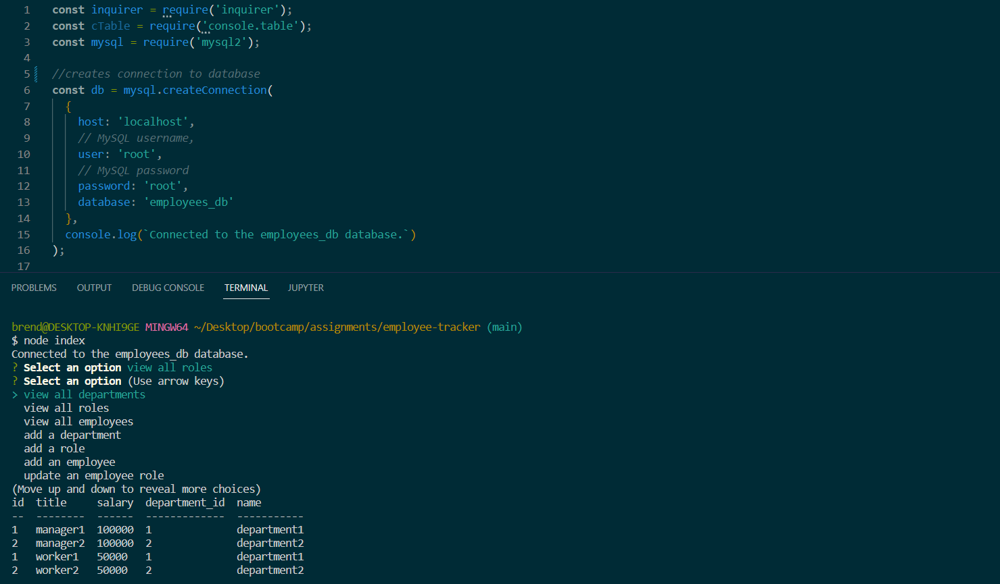

# employee-tracker

## Description

This application allows the user to view the "department", "role", and "employee" tables, add entries to those tables, and to update the roles of employees

## Installation

This application requires node.js and MySQL Server. Open the main folder containing "index.js" of the application in a terminal and enter "npm install".

## Usage

Open a MySQL shell in the "db" folder and enter "source schema.sql" create the "employees_db" database. This will also drop any existing database with that name. To seed the database with sample data, enter "source seeds.sql". Open the main folder containing "index.js" in a terminal and enter "node index" and then select whether to view a table, add to a table, or update an entry. Enter any data the prompt asks for. The application may need to be exited and restarted in order to view newly entered data. 

https://github.com/BrendanShelton/employee-tracker

## Credits

N/A

## License

MIT License

Copyright (c) 2022 BrendanShelton

Permission is hereby granted, free of charge, to any person obtaining a copy
of this software and associated documentation files (the "Software"), to deal
in the Software without restriction, including without limitation the rights
to use, copy, modify, merge, publish, distribute, sublicense, and/or sell
copies of the Software, and to permit persons to whom the Software is
furnished to do so, subject to the following conditions:

The above copyright notice and this permission notice shall be included in all
copies or substantial portions of the Software.

THE SOFTWARE IS PROVIDED "AS IS", WITHOUT WARRANTY OF ANY KIND, EXPRESS OR
IMPLIED, INCLUDING BUT NOT LIMITED TO THE WARRANTIES OF MERCHANTABILITY,
FITNESS FOR A PARTICULAR PURPOSE AND NONINFRINGEMENT. IN NO EVENT SHALL THE
AUTHORS OR COPYRIGHT HOLDERS BE LIABLE FOR ANY CLAIM, DAMAGES OR OTHER
LIABILITY, WHETHER IN AN ACTION OF CONTRACT, TORT OR OTHERWISE, ARISING FROM,
OUT OF OR IN CONNECTION WITH THE SOFTWARE OR THE USE OR OTHER DEALINGS IN THE
SOFTWARE.